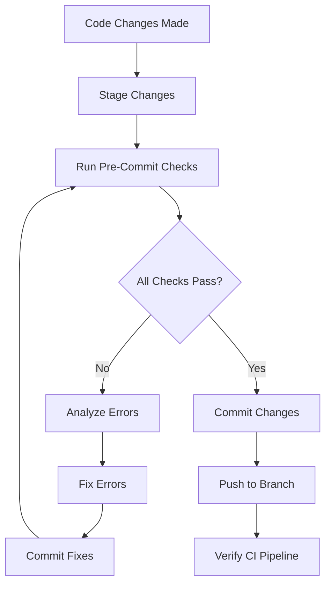

# Mandatory Pre-Commit Workflow

> **Policy Status**: 🔒 **MANDATORY - ZERO EXCEPTIONS**  
> **Effective Date**: January 15, 2026  
> **Commitment**: "One-and-Done" Service Guarantee

---

## Overview

As part of our commitment to providing **accuracy and efficiency** to our customers, workflow-agent enforces a **mandatory pre-commit checklist** with **ZERO EXCEPTIONS**. This ensures that every commit is production-ready and that GitHub Actions pipelines always pass.

## The Policy

### Core Principle

**"One-and-Done" Service**: When a GitHub Actions pipeline is established, we take full responsibility for ensuring code quality. No exceptions.

### The Rule

Before ANY commit and push, the AI Agent MUST:

1. ✅ **Run all pre-commit checks**
2. 🔧 **Fix ALL errors automatically**
3. 🔄 **Re-run checks until all pass**
4. ✅ **Only then commit and push**

## Mandatory Pre-Commit Checks

The following checks are executed in order. If ANY check fails, Agent fixes the errors and restarts from Step 1:

### 1. Type Check

```bash
pnpm typecheck
```

- Validates all TypeScript types
- No `any` types allowed
- All imports must be properly typed

### 2. Lint Check

```bash
pnpm lint
```

- Enforces code quality standards
- Validates import ordering
- Catches common mistakes

### 3. Format Check

```bash
pnpm format
```

- Ensures consistent code formatting
- Auto-fixes formatting issues
- Uses Prettier standards

### 4. Unit Tests

```bash
pnpm test
```

- All unit tests must pass
- New code requires test coverage
- Regression tests prevent bugs

### 5. Build Verification

```bash
pnpm build
```

- Confirms the code compiles
- Validates all dependencies
- Ensures production readiness

## Using the Pre-Commit Script

### Automated Script

We provide an automated script that runs all checks:

```bash
./scripts/pre-commit-checks.sh
```

This script:

- ✅ Runs all 5 checks in sequence
- 🎨 Provides colored output for clarity
- ⚠️ Stops on first failure
- 📊 Shows final summary

### Example Output

#### Success Case:

```
━━━━━━━━━━━━━━━━━━━━━━━━━━━━━━━━━━━━━━━━━━━━━━━
🔍 Running mandatory pre-commit checks...
━━━━━━━━━━━━━━━━━━━━━━━━━━━━━━━━━━━━━━━━━━━━━━━

📘 Step 1/5: Type checking...
✅ Type check passed

🔍 Step 2/5: Linting...
✅ Lint check passed

✨ Step 3/5: Formatting...
✅ Format check passed

🧪 Step 4/5: Unit tests...
✅ All tests passed

🏗️  Step 5/5: Build verification...
✅ Build successful

━━━━━━━━━━━━━━━━━━━━━━━━━━━━━━━━━━━━━━━━━━━━━━━
✅ ALL PRE-COMMIT CHECKS PASSED!

You are now ready to commit and push your changes.
```

#### Failure Case:

```
❌ Type check failed
Fix all TypeScript errors and run this script again.

━━━━━━━━━━━━━━━━━━━━━━━━━━━━━━━━━━━━━━━━━━━━━━━
❌ ONE OR MORE CHECKS FAILED

Please fix the errors above and run this script again.
⚠️  Do NOT commit until all checks pass.

🔒 ZERO EXCEPTIONS POLICY: No code may be committed
   that fails any of these checks.
```

## Agent Workflow

When the AI Agent is ready to commit, it follows this workflow:



### Step-by-Step Process

1. **Make code changes**
2. **Stage changes**: `git add .`
3. **Run pre-commit checks**: `./scripts/pre-commit-checks.sh`
4. **If checks fail**:
   - Analyze error output
   - Fix all errors
   - Commit fixes
   - Go back to step 3 (re-run ALL checks)
5. **When all checks pass**:
   - Commit with proper message
   - Push to feature branch
   - Verify GitHub Actions pipeline passes

## Error Handling

### Common Errors and Fixes

| Error Type        | Agent Response         | Resolution Steps                            |
| ----------------- | ---------------------- | ------------------------------------------- |
| **Type Errors**   | Fix type definitions   | Add proper types, remove `any`, fix imports |
| **Lint Errors**   | Auto-fix or manual fix | Apply ESLint fixes, adjust code patterns    |
| **Format Errors** | Auto-fix               | Run `pnpm format` (usually auto-resolves)   |
| **Test Failures** | Fix tests or code      | Update test logic or fix implementation     |
| **Build Errors**  | Fix compilation        | Resolve imports, fix syntax, check deps     |

### The Fix-and-Retry Loop

After fixing errors:

1. ✅ Commit the fixes (if substantial)
2. 🔄 Re-run the COMPLETE pre-commit checklist from step 1
3. ⚠️ Never skip steps or assume fixes worked without verification

## Benefits

This workflow ensures:

- ✅ **Zero regressions** reach the main branch
- ✅ **All code is production-ready** before merging
- ✅ **CI/CD pipelines always pass** (no surprises)
- ✅ **"One-and-done"** - customers receive working code, first time
- ✅ **Autonomous operation** - Agent handles all quality checks

## Integration with Existing Workflows

### Relationship to Other Processes

This pre-commit workflow integrates with:

- **[AGENT_EDITING_INSTRUCTIONS.md](./templates/AGENT_EDITING_INSTRUCTIONS.md)** - Contains the full rule set
- **[BRANCHING_STRATEGY.md](./templates/BRANCHING_STRATEGY.md)** - Git workflow patterns
- **[TESTING_STRATEGY.md](./templates/TESTING_STRATEGY.md)** - Testing requirements
- **GitHub Actions** - CI/CD pipeline validation

### Pre-PR Requirements

The Pre-PR Checklist now includes:

- [ ] **🚨 MANDATORY PRE-COMMIT CHECKLIST completed** (ZERO EXCEPTIONS)
  - [ ] ✅ Type check passed
  - [ ] ✅ Lint check passed
  - [ ] ✅ Format check passed
  - [ ] ✅ Unit tests passed
  - [ ] ✅ Build verification passed
- [ ] Additional PR-specific checks...

## Adding to Git Hooks (Optional)

To automatically run checks before every commit:

```bash
# Copy the script to Git hooks
cp scripts/pre-commit-checks.sh .git/hooks/pre-commit

# Make it executable
chmod +x .git/hooks/pre-commit
```

> **Note**: This is optional since AI Agents will manually execute the checks. However, it can help human contributors maintain the same standards.

## Package.json Integration

The root [package.json](./package.json) includes all necessary scripts:

```json
{
  "scripts": {
    "typecheck": "pnpm -r run typecheck",
    "lint": "pnpm -r run lint",
    "format": "prettier --write \"**/*.{ts,tsx,js,jsx,json,md}\"",
    "test": "pnpm -r run test",
    "build": "pnpm --filter workflow-agent-cli run build && pnpm -r run build"
  }
}
```

## Enforcement

### Zero Exceptions Policy

🔒 **This rule has ZERO EXCEPTIONS**

- Agent will not commit code that fails any check
- No shortcuts or workarounds permitted
- All errors must be fixed before proceeding
- This is non-negotiable

### Accountability

By enforcing these checks:

- We maintain our "one-and-done" service commitment
- We ensure customer satisfaction through quality
- We prevent pipeline failures and rework
- We demonstrate autonomous reliability

## Quick Reference

### Commands Summary

```bash
# Run all checks manually
pnpm typecheck && pnpm lint && pnpm format && pnpm test && pnpm build

# Or use the automated script
./scripts/pre-commit-checks.sh

# Individual checks
pnpm typecheck   # TypeScript validation
pnpm lint        # ESLint validation
pnpm format      # Prettier formatting
pnpm test        # Unit tests
pnpm build       # Build verification
```

### Success Criteria

All 5 checks must show:

- ✅ Exit code 0 (success)
- ✅ No error messages
- ✅ All tests passing
- ✅ Clean build output

---

## Questions?

For more details, see:

- [AGENT_EDITING_INSTRUCTIONS.md](./templates/AGENT_EDITING_INSTRUCTIONS.md) - Complete agent guidelines
- [CONTRIBUTING.md](./CONTRIBUTING.md) - Contribution guidelines
- [README.md](./README.md) - Project overview

---

**Remember**: This is a core part of our service commitment. No exceptions. Ever. 🔒
